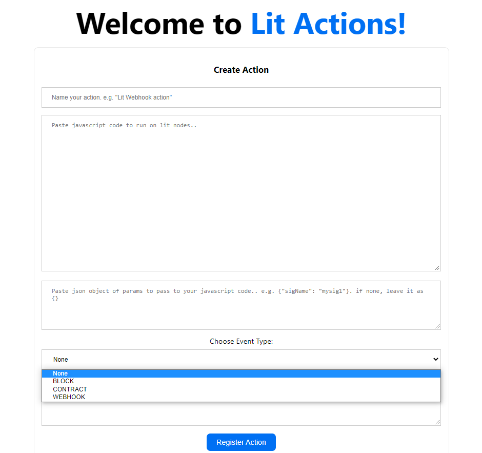

## Lit Actions Event Listener

**Note: This is a work in progress. Whole functionality is not ready yet. There may be many bugs and missing features.**

#### What are Lit Actions?

Lit Actions are JavaScript functions that can use the threshold cryptography that powers the Lit network. They are basically JavaScript smart contracts, only much more powerful.

#### Why Lit Actions Event Listener?

As of now, Lit Actions are being triggered by a user. The idea is to remove this reliance on user interactions and instead introduce event-based automation. This is where Lit Actions Event Listener comes in. It listens for on/off-chain events and triggers registered Lit Actions when they occur.

#### Proposed on/off chain events for Lit Actions:

1. Block Event - Triggered when a specified block is mined.
2. Webhook Event - (on HTTP webhook trigger)
3. Contract Event - Coming Soon (On smartcontract events)
4. Transaction Event - Coming Soon (on tranasction mined, on transaction confirmed, on transaction failed, on transaction pending)
5. Periodic Events - Coming Soon (e.g. every 5 minutes, every 1 hour, etc.)

#### Workflow

1. Registering a lit action with details of the action and event you want to listen for. When a user registers a Lit Action, they provide the following details:

- action name (e.g. "my webhook action")
- action code
- js parameters (optional)
- event type (block, webhook, contract)
- chainId/name that event to be emitted
- event details (e.g. block number, contract address, contract event name etc.)

There wil be some validations on the action code and event details before storing the action. if they are valid, the action is stored in the database. you can find relavent code here `pages/api/graphql.js`. These details are stored in database and used to trigger the action when the event occurs.

**Note: User auth will also be added to this. So that logged in users can see/update/delete all their actions in place.**
**Currently, chainId is not being specified by user(defaults to mainnet for now). It will be used in future to support multiple chains.**

2. Lit Actions Event Listener listens for the event.

When the Lit Actions Event Listener starts, it fetches all the registered actions from the database(specific to current mined block if block event) and starts listening for the events. When an event occurs, it triggers the action.

if it is a webhook event, it will be triggered when the webhook is called with the actionId and payload as parameters. if action exists in database, it will fetch action details from database, validate the action and trigger the action. you can find relavent code here `pages/api/actions/webhook/trigger.js`

3. When the event occurs, Lit Actions Event Listener triggers the registered action with the details they provide in the action.

#### Getting Started

1. Preparing Database Schema (MongoDB suggested)

> Make sure env variable `DATABASE_URL` is set to your MongoDB URI

```bash
yarn install
yarn prima db push
```

2. Start the app

```bash
yarn dev
```

#### Demo



### Safety

This is experimental software and should evolve over time. It is not recommended to use this in production.

Lit Actions Listener is a proof of concept and is not ready for production use. It is not audited and has not been tested for security. Use at your own risk.
I do not give any warranties and will not be liable for any loss incurred through any use of this codebase.

#### Contributing
